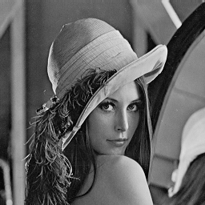
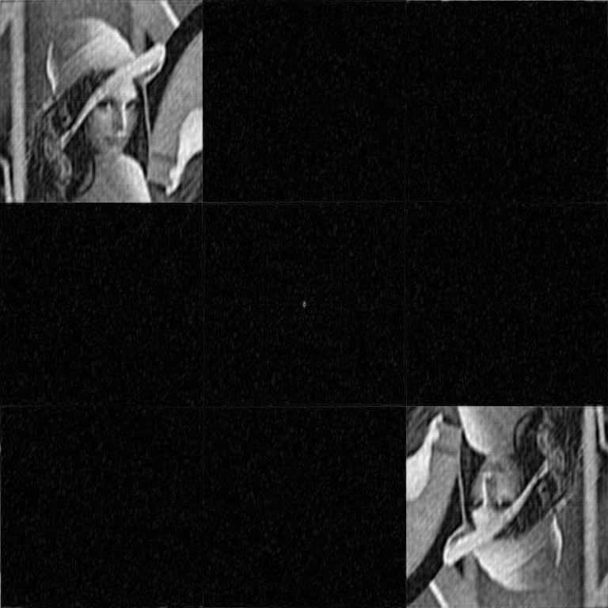
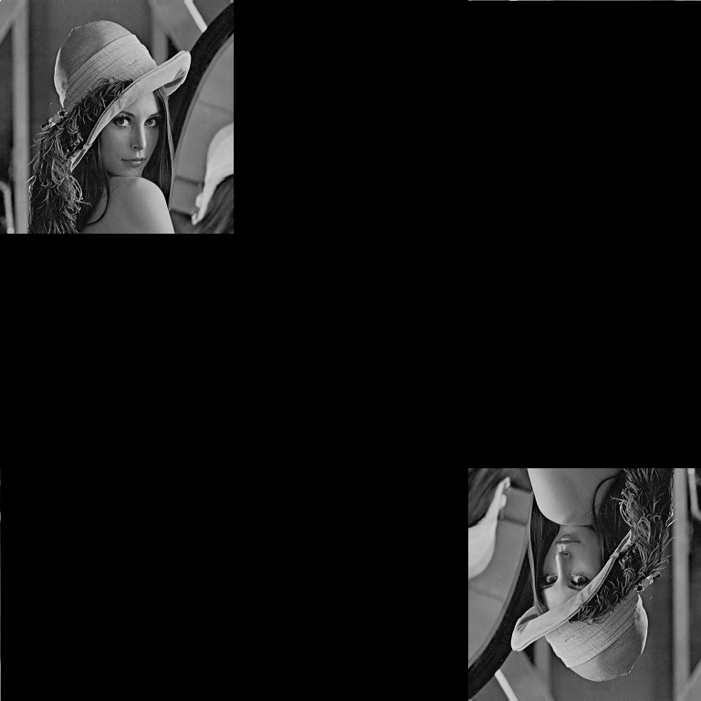
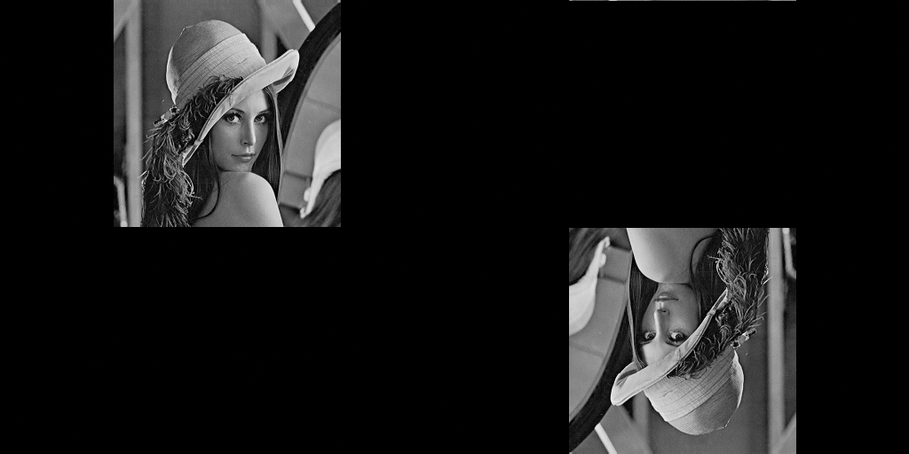

# Correlation pattern recognition

This is a project that I have implemented as part of my scientific work. It can be used to
simulate correlation pattern recognition (CPR) in a coherent optical system (correlator)
using various spatial light modulators (SLM).

## 1. Installing

Install **Python 3.x**.

Clone repository and cd to project directory:
```shell
git clone https://github.com/Chifffa/correlation_pattern_recognition.git
cd cpr_project
```
Install dependencies:
```shell
pip install -r requirements.txt
```

## 2. Quick start
Follow `main.py` to quick start and make some modelling on some data. Main steps:
- import main class and functions:
```python
from cpr import parse_yaml_config, CorrelationPatternRecognition, update_config
```
- load default configuration:
```python
import os

config = parse_yaml_config(os.path.join('data', 'config.yml'))
basic_config, default_config = config['basic'], config['default']
```
- update configuration if you need:
```python
config = update_config(basic_config, default_config, ...)
```
- run modelling:
```python
cpr_object = CorrelationPatternRecognition(basic_config)
cpr_object.work('path/to/dataset.npy', [config])
```

## 3. Prepare custom modelling configuration
A detailed description of the parameters will be in future (I hope). See `data/config.yml`
and code documentation.

See `main.py` to create custom configurations.

For classification of correlation signals a trained CNN model can be used. You can use
trained model (`data/frozen_model.onnx`).
Use (**https://github.com/Chifffa/cnn_model_for_cpr**) to train your own model.

## 4. Prepare dataset

You can load my prepared data (I hope that link will be here in future).

### Custom dataset preparation

1. repare folder with images as follows:
```
your_data_directory:
    case_1:
        class_true_train:
            image_1.png
            image_2.png
            ...
        class_true_test:
            image_3.png
            image_4.png
            ...
        class_false_1:
            image_1.png
            image_10.png
            ...
        class_false_2:
            image_0.png
            any_image_name.jpg
            ...
        ...
    case_2: ...
    case_3: ...
    ...
```
2. All `case_n` can have any name but **must have exactly same folders structure**.
3. Modify `data/config.yml` (add your dataset name there).
4. Modify `prepare_dataset` function in `cpr/utils.py` in accordance with your data structure.
5. Run `prepare_dataset()` and your dataset will be prepared and saved in `datasets`.

## 5. Additional features

There are some additional features in this project.

1. Wrapper over numpy.fft2 and numpy.ifft2 for image processing:
```python
from cpr import fft2, ifft2
```
2. Function for creating Fourier holograms:
- Read example image:
```python
import os

import cv2

examples_path = os.path.join('data', 'examples_for_github')
image = cv2.imread(os.path.join(examples_path, 'lenna.bmp'), 0)
```


- Get amplitude Fourier hologram:
```python
import numpy as np

from cpr import amplitude_holo
holo = np.uint8(amplitude_holo(image, sample_level=8, scale=2))
```


- Restore hologram:
```python
from cpr import ifft2

holo_restored = np.abs(ifft2(holo))
holo_restored[holo_restored.shape[0] // 2, holo_restored.shape[1] // 2] = 0
holo_restored = holo_restored - np.min(holo_restored)
holo_restored = np.uint8(holo_restored / np.max(holo_restored) * 255)
```


- You can use phase mask to improve restoration quality:

```python
from cpr import random_phase_mask

holo = amplitude_holo(random_phase_mask(image), sample_level=8, scale=2)
holo_restored = np.abs(ifft2(holo))
holo_restored[holo_restored.shape[0] // 2, holo_restored.shape[1] // 2] = 0
holo_restored = holo_restored - np.min(holo_restored)
holo_restored = np.uint8(holo_restored / np.max(holo_restored) * 255)
```
This is how Fourier hologram looks like now:


And this is improved restoration:



- Also you can create custom size of hologram:
```python
    holo = amplitude_holo(random_phase_mask(image), sample_level=8, scale=2, experiment_shape=(512, 1024))
    holo_restored = np.abs(ifft2(holo))
    holo_restored[holo_restored.shape[0] // 2, holo_restored.shape[1] // 2] = 0
    holo_restored = holo_restored - np.min(holo_restored)
    holo_restored = np.uint8(holo_restored / np.max(holo_restored) * 255)
```


See `holo_example.py` for full **lenna.bmp** processing.

## 6. Publications

This project was used in my scientific work. There are all my publications here:

1. Measurement of additional phase modulation of an amplitude liquid 
   crystal spatial light modulator HoloEye LC 2002 by dual-beam interferometric 
   method / D.S. Goncharov, V.V. Krasnov, N.M. Ponomarev, R.S. Starikov 
   // Practical Holography XXXII: Displays, Materials, and Applications / 
   International Society for Optics and Photonics. — Vol. 10558. — 2018. — 
   P. 105580Y.
   
2. The influence of additional phase modulation of an amplitude liquid 
   crystal STLM on the image recognition characteristics in the invariant optical 
   digital correlator / D.S. Goncharov, N.N. Evtikhiev, V.V. Krasnov et al. 
   // Computer Optics. — 2019. — Vol. 43, no. 2. — Pp. 200–208.

3. Features of the implementation of holographic invariant correlation 
   filters based on a phase liquid-crystal space-time light modulator / D.S. 
   Goncharov, E.Yu. Zlokazov, E.K. Petrova et al. // Bulletin of the Lebedev 
   Physics Institute. — 2019. — Vol. 46, no. 4. — Pp. 126–129.

4. Implementation of Fourier holograms using high-performance DMD SLM 
   / D.S. Goncharov, R.S. Starikov, N.M. Ponomarev, D.Yu. Molodtsov // 
   Procedia Computer Science. — 2020. — Vol. 169. — Pp. 558–563.

5. Implementation features of invariant optical correlator based on 
   amplitude LC SLM / D.S. Goncharov, E.K. Petrova, N.M. Ponomarev et 
   al. // Optical Memory and Neural Networks. — 2020. — Vol. 29, no. 2. — Pp. 
   110–117.

6. Goncharov, D.S. Improving correlation method with convolutional neural networks
   / D.S. Goncharov, R.S. Starikov // arXiv preprint arXiv: 2004.09430. — 2020.
   
All articles you can find here: https://www.researchgate.net/profile/Dmitriy_Goncharov4.
